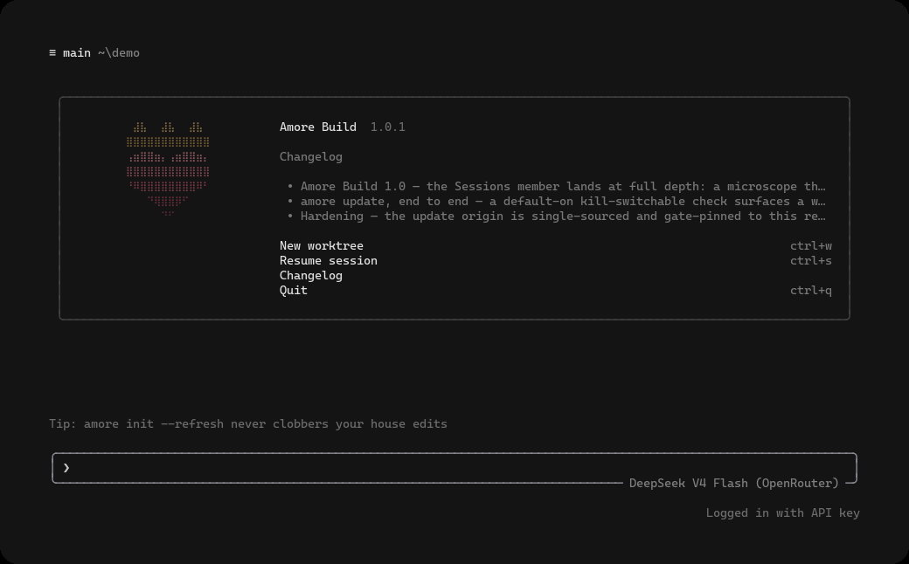
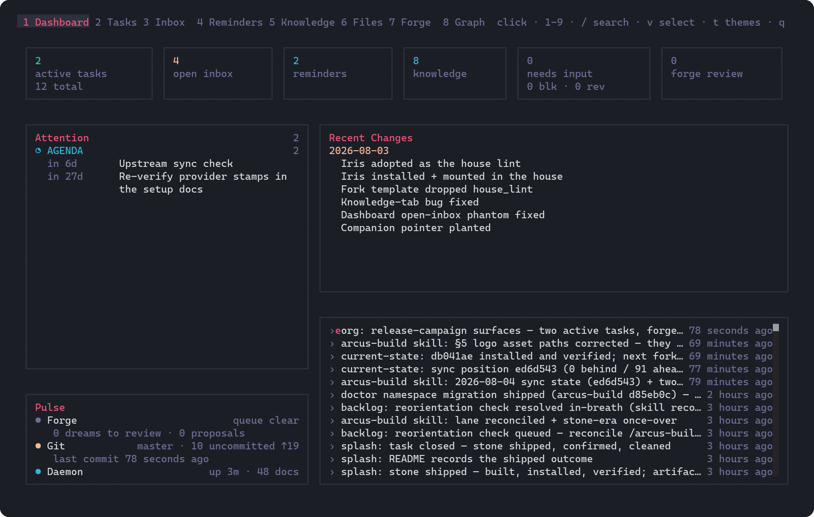

# Amore Build

**a terminal coding agent that works from a house, not a checkout**

Amore Build (`amore`) is a terminal AI coding agent: a full-screen TUI that
understands your codebase, edits files, runs shell commands, searches the web,
and drives long-running multi-agent work — interactively, headlessly for
scripting/CI, or embedded in editors via ACP.

What sets it apart is the **house**. The usual way to run a coding agent is
to launch it inside each project, where context lives and dies with the
checkout. With Amore Build you create a house once (`amore init`) and launch
from it always: one working tree the agent inhabits — orientation surfaces
read at session start, org schemas for tasks / captures / knowledge /
reminders, cross-project doctrine, orchestration skills, and session hooks
including a stop gate — while your project repos live around it, each
keeping its own history. The point of the house is time: every session
starts where the last one stopped, and lessons banked in one project apply
to the next. The **iris** companion keeps the house's live index with a
loopback-only daemon, org CLI verbs, and an eight-tab dash. Any
OpenAI-compatible model drives it: every model is one `[model.*]` config
block, and the harness identity survives the swap. The working method:
[docs/the-house.md](docs/the-house.md).

It is a **permanent engineered fork** of xAI's open-source
[`grok-build`](https://github.com/xai-org/grok-build) (Apache-2.0). **Not an
xAI product, and not affiliated with any model vendor.** Upstream provenance
and sync cadence: [`UPSTREAM.md`](UPSTREAM.md).



---

## Install

### Installing the released binary

Prebuilt binaries are published for macOS, Linux, and Windows:

```sh
curl -fsSL https://amore.build/download/amore-install-sh | bash   # macOS / Linux / Git Bash
irm https://amore.build/download/amore-install-ps1 | iex          # Windows PowerShell
amore --version
```

The installers fetch the newest [GitHub Release](https://github.com/vincitamore/amore-build/releases)
asset for your platform, verify its published sha256, and install the binary
(`~/.local/bin` on unix, `%USERPROFILE%\amore\bin` on Windows — override with
`AMORE_INSTALL_DIR`, pin a tag with `AMORE_VERSION`). Linux binaries target
glibc 2.35+ (Ubuntu 22.04 or newer, Debian 12 or newer). They are
[`scripts/install.sh`](scripts/install.sh) and
[`scripts/install.ps1`](scripts/install.ps1) in this repository if you prefer
to read before you run.

**To upgrade, re-run the same installer**: it fetches and verifies the newest
release and keeps the previous binary beside it as `amore.prev` for rollback.
(In-app auto-update is compiled off in this fork; the installer is the upgrade
path.)

### First session

The one-liner installs the `amore` binary only — the house and the iris
companion arrive in step 3, not with the installer:

1. **Install** (above), then `amore --version`.
2. **`amore setup`** — the guided wizard writes model credentials and config
   under `~/.amore`.
3. **`amore init`** — run it in the directory that will become your house: it
   plants the house tree and installs the [iris companion](docs/iris.md)
   binaries onto `PATH` beside `amore`.
4. **Launch `amore` from the house.** Every session after this one starts
   where the last one stopped.

### Uninstall

The footprint is enumerable, and removing it is three deletes:

- **Binaries** — remove the install dir (`~/.local/bin/amore*` on unix,
  `%USERPROFILE%\amore\bin` on Windows). The iris binaries `amore init`
  linked onto `PATH` live beside `amore`, so they go with it.
- **State** — remove `~/.amore` (config + credentials) and `~/.iris`
  (iris's root-trust allow list and logs).
- **Houses** — any house you created is an ordinary directory that belongs
  to you (usually its own git repo). Keep it or delete it; nothing else
  references it.

See the [changelog](crates/codegen/xai-grok-shell-base/assets/amore-changelog.md)
for the latest fixes, features, and improvements in each release (also
rendered in-product on the welcome screen and by `/release-notes`).

> **PATH note:** `amore doctor` (and `amore doctor --json`, field
> `pathCollision`) detects when another `amore` binary on `PATH` would shadow
> Amore Build.

### Build from source

Requirements:

- **Rust** — pinned by [`rust-toolchain.toml`](rust-toolchain.toml); `rustup`
  installs it on first build.
- **protoc** — on your `PATH`, or pointed at by `$PROTOC`. Any recent release
  works; this is what CI uses on every platform.

Optionally, [DotSlash](https://dotslash-cli.com) can run the pinned tool under
[`bin/`](bin/) instead. It is not required, and not available on Windows — the
build falls back to `protoc` on `PATH` by design.

```sh
git clone https://github.com/vincitamore/amore-build.git
cd amore-build

cargo run -p xai-grok-pager-bin              # build + launch the TUI
cargo build -p xai-grok-pager-bin --release  # release binary
```

The composition-root crate is `xai-grok-pager-bin`; the public binary name is
**`amore`** (argv0 also tolerates `amore-build`, `grok`, and `agent`). After a
release build the artifact is typically
`target/release/amore` (or `amore.exe` on Windows).

Home defaults to **`~/.amore`** (override with `$AMORE_HOME`; legacy
`$GROK_HOME` still works). Project config lives under **`.amore/`** (`.grok/`
is kept as a legacy fallback; `.amore` wins when both exist).

---

## Quickstart

Amore Build is **model-agnostic by design**: every model is a config entry
pointed at an OpenAI-compatible endpoint, and the identity the model is given
does not name a model at all (see below) — so entries can be swapped and
compared without the harness caring which one is behind them. The wizard's
recommended default is **DeepSeek V4 Flash** over OpenRouter (the
maintainer's daily driver); GLM-5.2 recipes ship alongside, and any
OpenAI-compatible host works. Native xAI grok is the **second rail**
(subagent freight + first-party catalog).

### Guided path (recommended)

On first interactive launch with no credentials resolved, Amore opens a
setup wizard. You can also run it anytime:

```sh
amore setup            # interactive wizard when on a TTY
amore setup --headless # print steps without prompts
amore setup --reset    # clear wizard state
amore setup --force    # re-run past done/skipped
```

Hard guards: the auto first-run wizard **never** fires headless (`-p` / piped),
in CI, when `[agent] setup_on_first_run = false`, or after state is
done/skipped under `~/.amore`. Team managed config is a separate path:
`amore setup --managed` (legacy `amore setup --json` still works).

### Manual paths (condensed)

Config: `~/.amore/config.toml`. Prefer `env_key` over a literal `api_key`.
**Every** custom `[model.*]` block **must** set `system_prompt_label` —
an unlabeled model falls through the resolver chain to a default and will
confidently answer to the wrong name.

Give that label the **harness and the role, not the model**. Upstream renders
it as `You are <label>`, so a label naming the model becomes false the moment
you point the entry at a different one — and the block it lives in is
per-model already, so the model name is never the thing missing.

| Path | Model id (wire) | Base URL | Env |
|------|-----------------|----------|-----|
| **DeepSeek V4 Flash via OpenRouter** (recommended) | `deepseek/deepseek-v4-flash-0731` | `https://openrouter.ai/api/v1` | `OPENROUTER_API_KEY` |
| **DeepSeek direct** | `deepseek-v4-flash` | `https://api.deepseek.com` | `DEEPSEEK_API_KEY` |
| **GLM-5.2** (OpenRouter / Z.ai direct) | `z-ai/glm-5.2` / `glm-5.2` | OpenRouter / `https://api.z.ai/api/paas/v4` | `OPENROUTER_API_KEY` / `ZAI_API_KEY` |
| **Any OpenAI-compatible host** | host-specific | your `/v1` base | host token env |

Minimal sketch (the wizard writes exactly this):

```toml
[models]
default = "deepseek-openrouter"

[model.deepseek-openrouter]
model = "deepseek/deepseek-v4-flash-0731"
base_url = "https://openrouter.ai/api/v1"
name = "DeepSeek V4 Flash (OpenRouter)"
env_key = "OPENROUTER_API_KEY"
system_prompt_label = "Amore Build"
context_window = 1048576
# Reasoning tokens draw from this too — it is the provider's reported
# ceiling, not a target; a lower cap truncates the reasoning pass invisibly.
max_completion_tokens = 65536
```

Full recipes, pricing stamps, alternate hosts, and verify commands:
[`docs/setup-models.md`](docs/setup-models.md). Multi-provider sample:
[`examples/config.multi-provider.toml`](examples/config.multi-provider.toml).

```sh
export OPENROUTER_API_KEY="sk-or-..."   # your key
amore -m deepseek-openrouter -p "Reply with exactly: AMORE-DS-OK"
```

---

## Grok native (second rail)

Native grok subagent freight and first-party xAI models ride a **separate**
credential rail from your BYOK model:

```sh
amore login                 # browser OAuth (PKCE) against xAI
amore login --device-auth   # device-code for headless / remote
# or:
export XAI_API_KEY="xai-..." # console key; no OAuth required
```

BYOK primary + grok freight = **two meters, two credentials**. BYOK models
never require OAuth, and a model's own key always wins over the session.
Details: [`docs/authentication.md`](docs/authentication.md).

---

## The cooperation harness

```sh
amore init              # create a house: orientation surfaces, schemas, skills, hooks, iris
amore init --dry-run    # plan only
amore init --refresh    # rewrite files still matching the install manifest
```

`amore init` **creates a house** — a working tree for long-horizon
collaboration with the agent: root `AGENTS.md`, folder schemas (`context/`,
`inbox/`, `tasks/`, `knowledge/`, `reminders/`, `forge/`), a 6-skill
orchestration pack, session hooks, the iris companion, and
`.amore/house-install.json` recording ownership. **Lattice is default-on**
(`--no-lattice` opt-out); skills and hooks default-on (`--no-skills` /
`--no-hooks`); iris default-on (`--no-iris` opts out and makes init fully
offline). Ownership-aware: never silently overwrites user edits; `--refresh`
only rewrites files whose on-disk hash still matches the manifest; `--force`
overwrites (confirm, or `--yes`).

What got installed and what you own: [`docs/onboarding.md`](docs/onboarding.md).

---

## Iris companion

**Iris** is the house's knowledge/org instrument: a live file index daemon,
org CRUD verbs (`task` / `inbox` / `reminder` / `knowledge`), and an
interactive dash over the tree `amore init` plants — Dashboard, Tasks,
Inbox, Reminders, Knowledge, Files, Forge, and Graph tabs. `amore init`
installs it into the house by default and links it beside the `amore`
binary, so it is on `PATH` with no manual step; it is never required to run
Amore Build itself. Every write goes through its **regula** core — schemas,
legal lifecycle transitions, placement, lint — and the planted `AGENTS.md`
wires the resident agent to the same verbs. Local-first: the daemon binds loopback only, and there is no
telemetry. Full story (with a screenshot of every tab):
[`docs/iris.md`](docs/iris.md).



---

## Documentation

| Doc | What |
|-----|------|
| [`docs/the-house.md`](docs/the-house.md) | **The house** — the one-launch-point working method the fork is built around |
| [`docs/setup-models.md`](docs/setup-models.md) | BYOK model recipes (DeepSeek / GLM / any OpenAI-compatible host) |
| [`docs/authentication.md`](docs/authentication.md) | OAuth + BYOK dual rail, `auth.json` anti-copy rule |
| [`docs/onboarding.md`](docs/onboarding.md) | `amore init` house tree, ownership, refresh |
| [`docs/iris.md`](docs/iris.md) | Iris companion |
| [`UPSTREAM.md`](UPSTREAM.md) | Fork provenance and sync policy |
| [`examples/config.multi-provider.toml`](examples/config.multi-provider.toml) | Multi-provider config sample |

Deep feature reference ships in-tree with the pager crate:
[`crates/codegen/xai-grok-pager/docs/user-guide/`](crates/codegen/xai-grok-pager/docs/user-guide/)
(slash commands, theming, MCP, skills, hooks, headless, sandboxing, …). Some
paths there still use upstream brand spellings (`grok` / `~/.grok`); the fork
home is `~/.amore` and the public binary is `amore`.

Product env surface: **`AMORE_*` primary** with silent `GROK_*` legacy
aliases (`AMORE_HOME`, `AMORE_DEFAULT_MODEL`, `AMORE_SYSTEM_PROMPT_LABEL`,
`AMORE_AUTH_*`, …). Provider keys (`XAI_API_KEY`, other vendor keys) stay
unaliased. Auto-update is hard-off in this fork (no in-app xAI reinstall
hints); to upgrade, re-run the installer — it keeps an `amore.prev` rollback.

---

## Egress

On the wire, the shipped binary talks to the endpoints you configure and
nothing else. The telemetry subsystem inherited from upstream ships inert:
disabled by default, no client constructed while disabled, no token baked
into any release build, and every upstream sync re-verifies that posture
mechanically. Both credential rails of the shipped binaries were captured
under syscall-level tracing before this claim was written: the method is
[`scripts/egress_capture.sh`](scripts/egress_capture.sh) and the receipts
are in [`docs/egress.md`](docs/egress.md).

---

## License

First-party code is **Apache License 2.0** — see [`LICENSE`](LICENSE) and
[`NOTICE`](NOTICE). Third-party and vendored code remains under its original
licenses; start at [`THIRD-PARTY-NOTICES`](THIRD-PARTY-NOTICES) and
[`third_party/NOTICE`](third_party/NOTICE).
