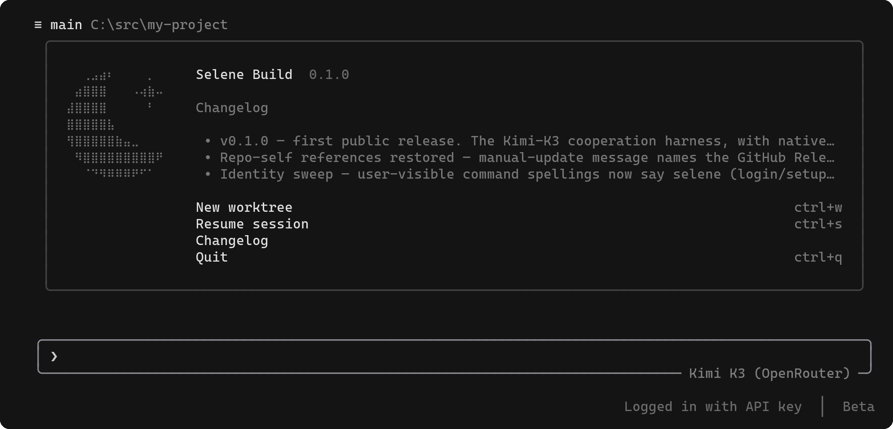

# Selene Build

<pre>
⠀⠀⢀⣠⣴⠆⠀⠀⠀⠀⡀⠀⠀
⠀⣴⣿⣿⣿⠀⠀⠀⠠⢴⣷⠤⠀
⣼⣿⣿⣿⣿⠀⠀⠀⠀⠀⠃⠀⠀
⣿⣿⣿⣿⣿⣧⠀⠀⠀⠀⠀⠀⠀
⢻⣿⣿⣿⣿⣿⣷⣤⣀⠀⠀⠀⠀
⠀⠻⣿⣿⣿⣿⣿⣿⣿⣿⣿⠟⠀
⠀⠀⠈⠙⠻⠿⠿⠿⠟⠋⠁⠀⠀
</pre>

**the Kimi-K3 cooperation harness, with native grok subagent freight**

Selene Build (`selene`) is a terminal AI coding agent: a full-screen TUI that
understands your codebase, edits files, runs shell commands, searches the web,
and drives long-running multi-agent work — interactively, headlessly for
scripting/CI, or embedded in editors via ACP.

It is a **permanent engineered fork** of xAI's open-source
[`grok-build`](https://github.com/xai-org/grok-build) (Apache-2.0). **Not an
xAI product. Not a Moonshot product.** Upstream provenance and sync cadence:
[`UPSTREAM.md`](UPSTREAM.md).



---

## Install

### Build from source

Requirements:

- **Rust** — pinned by [`rust-toolchain.toml`](rust-toolchain.toml); `rustup`
  installs it on first build.
- **[DotSlash](https://dotslash-cli.com)** — so hermetic tools under
  [`bin/`](bin/) (notably [`bin/protoc`](bin/protoc)) can download and run.
  Put `dotslash` on your `PATH` **before** building.
- **protoc** — resolved via DotSlash, or a `protoc` on `PATH` / `$PROTOC`.

```sh
git clone https://github.com/vincitamore/selene-build.git
cd selene-build

cargo install dotslash   # once, if needed
cargo run -p xai-grok-pager-bin              # build + launch the TUI
cargo build -p xai-grok-pager-bin --release  # release binary
```

The composition-root crate is `xai-grok-pager-bin`; the public binary name is
**`selene`** (argv0 also tolerates `selene-build`, `grok`, and `agent`). After a
release build the artifact is typically
`target/release/selene` (or `selene.exe` on Windows).

### Release assets

Prebuilt assets ship with **`v0.1.0`** (and later tags) on the project's
[GitHub Releases page](https://github.com/vincitamore/selene-build/releases).
Install the binary for your OS/arch and put it on
`PATH`.

> **PATH note:** crates.io already publishes a Lua linter named `selene`.
> That is a different tool. `selene doctor` (and `selene doctor --json`, field
> `pathCollision`) detects when another `selene` on `PATH` would shadow Selene
> Build — it reports the collision; it does not claim the two packages
> "conflict" as installs.

Home defaults to **`~/.selene`** (override with `$SELENE_HOME`; legacy
`$GROK_HOME` still works). Project config lives under **`.selene/`** (`.grok/`
is kept as a legacy fallback; `.selene` wins when both exist).

---

## Quickstart — Kimi K3 first

The default model path is **Kimi K3** (OpenRouter, Moonshot direct,
or an open-weight/Modal-style host). Native xAI grok is the **second rail**
(subagent freight + first-party catalog).

### Guided path (recommended)

On first interactive launch with no credentials resolved, Selene opens a
setup wizard. You can also run it anytime:

```sh
selene setup            # interactive wizard when on a TTY
selene setup --headless # print steps without prompts
selene setup --reset    # clear wizard state
selene setup --force    # re-run past done/skipped
```

Hard guards: the auto first-run wizard **never** fires headless (`-p` / piped),
in CI, when `[agent] setup_on_first_run = false`, or after state is
done/skipped under `~/.selene`. Team managed config is a separate path:
`selene setup --managed` (legacy `selene setup --json` still works).

### Manual paths (condensed)

Config: `~/.selene/config.toml`. Prefer `env_key` over a literal `api_key`.
**Every** custom `[model.*]` block for K3 **must** set `system_prompt_label`
(unlabeled models resolve to the product default identity and play the wrong
persona).

| Path | Model id (wire) | Base URL | Env |
|------|-----------------|----------|-----|
| **OpenRouter** (lowest friction) | `moonshotai/kimi-k3` | `https://openrouter.ai/api/v1` | `OPENROUTER_API_KEY` |
| **Moonshot direct** | `kimi-k3` | `https://api.moonshot.ai/v1` | `MOONSHOT_API_KEY` |
| **Open-weight / Modal-style** | host-specific | your OpenAI-compatible `/v1` base | host token env |

Minimal OpenRouter sketch:

```toml
[models]
default = "k3-openrouter"

[model.k3-openrouter]
model = "moonshotai/kimi-k3"
base_url = "https://openrouter.ai/api/v1"
name = "Kimi K3 (OpenRouter)"
env_key = "OPENROUTER_API_KEY"
system_prompt_label = "Kimi K3, a Moonshot AI model"
context_window = 1048576
max_completion_tokens = 16384
```

Full recipes, pricing stamps, Modal/Together/Fireworks hosts, and verify
commands: [`docs/setup-k3.md`](docs/setup-k3.md). Multi-provider sample:
[`examples/config.multi-provider.toml`](examples/config.multi-provider.toml).

```sh
export OPENROUTER_API_KEY="sk-or-..."   # your key
selene -m k3-openrouter -p "Reply with exactly: K3-OR-OK"
```

---

## Grok native (second rail)

Native grok subagent freight and first-party xAI models ride a **separate**
credential rail from K3 BYOK:

```sh
selene login                 # browser OAuth (PKCE) against xAI
selene login --device-auth   # device-code for headless / remote
# or:
export XAI_API_KEY="xai-..." # console key; no OAuth required
```

K3 primary + grok freight = **two meters, two credentials**. BYOK models
never require OAuth; session JWT is never sent to foreign hosts. Details:
[`docs/authentication.md`](docs/authentication.md).

---

## The cooperation harness

```sh
selene init              # plant the house tree in a git repo
selene init --dry-run    # plan only
selene init --refresh    # rewrite files still matching the install manifest
```

`selene init` installs the embedded pack (`templates/house/`): root
`AGENTS.md`, folder schemas (`context/`, `inbox/`, `tasks/`, `knowledge/`,
`reminders/`, `forge/`), skills, hooks, and
`.selene/house-install.json`. **Lattice is default-on** (`--no-lattice`
opt-out); skills and hooks default-on (`--no-skills` / `--no-hooks`);
dioptra pointer note is opt-in (`--with-dioptra`). Ownership-aware: never
silently overwrites user edits; `--refresh` only rewrites files whose on-disk
hash still matches the manifest; `--force` overwrites (confirm, or `--yes`).

What got installed and what you own: [`docs/onboarding.md`](docs/onboarding.md).

---

## Dioptra companion

**Dioptra** is the optional companion instrument for house dash / regula
surfaces (tasks, inbox, reminders, knowledge). It is not bundled inside
`selene init` by default — install and run it separately when you want that
UI. Pointer and install story: [`docs/dioptra.md`](docs/dioptra.md).

---

## Documentation

| Doc | What |
|-----|------|
| [`docs/setup-k3.md`](docs/setup-k3.md) | Kimi K3 BYOK paths (OpenRouter / Moonshot / hosts) |
| [`docs/authentication.md`](docs/authentication.md) | OAuth + BYOK dual rail, `auth.json` anti-copy rule |
| [`docs/onboarding.md`](docs/onboarding.md) | `selene init` tree, ownership, refresh |
| [`docs/dioptra.md`](docs/dioptra.md) | Dioptra companion |
| [`UPSTREAM.md`](UPSTREAM.md) | Fork provenance and sync policy |
| [`examples/config.multi-provider.toml`](examples/config.multi-provider.toml) | Multi-provider config sample |

Deep feature reference ships in-tree with the pager crate:
[`crates/codegen/xai-grok-pager/docs/user-guide/`](crates/codegen/xai-grok-pager/docs/user-guide/)
(slash commands, theming, MCP, skills, hooks, headless, sandboxing, …). Some
paths there still use upstream brand spellings (`grok` / `~/.grok`); the fork
home is `~/.selene` and the public binary is `selene`.

Product env surface: **`SELENE_*` primary** with silent `GROK_*` legacy
aliases (`SELENE_HOME`, `SELENE_DEFAULT_MODEL`, `SELENE_SYSTEM_PROMPT_LABEL`,
`SELENE_AUTH_*`, …). Provider keys (`XAI_API_KEY`, other vendor keys) stay
unaliased. Auto-update is hard-off in this fork (no in-app xAI reinstall
hints).

---

## License

First-party code is **Apache License 2.0** — see [`LICENSE`](LICENSE) and
[`NOTICE`](NOTICE). Third-party and vendored code remains under its original
licenses; start at [`THIRD-PARTY-NOTICES`](THIRD-PARTY-NOTICES) and
[`third_party/NOTICE`](third_party/NOTICE).
