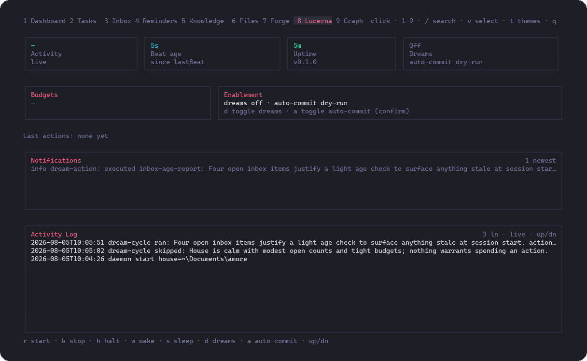
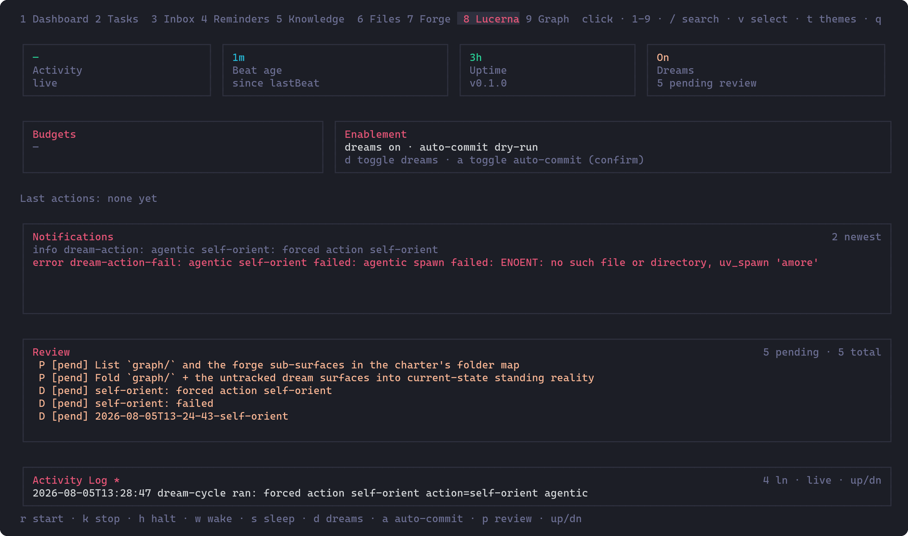

# Iris Lucerna surface

**Lucerna** is the house steward daemon. Iris exposes a loopback file proxy and
dash tab so the operator can observe and operate Lucerna without a second network
listener. Control stays file-based under `<house>/instruments/lucerna/`.

This page documents the iris side: the dash tab, CLI verbs, start/stop
semantics, enablement flags, and the shared file contract. Package sources live
under [`instruments/iris/`](../instruments/iris/) (proxy, routes, TUI, CLI) and
[`instruments/lucerna/`](../instruments/lucerna/) (the steward process).

The Lucerna tab, live against a running steward:



The Dashboard Pulse carries a Lucerna row with the daemon state and its most
recent outcome:


---

## Dash tab

The Lucerna tab is the ninth member in the iris dash (hotkey `8` in the
Dashboard … Lucerna … Graph order; bar shows `1`–`9`). It is honest at every
state:

| State | What the tab shows |
|-------|--------------------|
| Iris daemon down | Quiet notice; no poll |
| Not installed | Explainer and install hint (`amore init --with-lucerna`) |
| Stopped | Runtime dir present, no live heartbeat |
| Running | Fresh beat, budgets, enablement, log, notifications |
| Stale / hung | Available but beat older than two heartbeat intervals |

### Keys

| Key | Action |
|-----|--------|
| `r` | Start Lucerna (detached spawn via the iris daemon proxy) |
| `k` | Stop (confirm): halt sentinel, then pid kill only if still alive |
| `h` | Halt sentinel only (confirm) |
| `w` | Wake sentinel |
| `s` | Sleep sentinel |
| `d` | Toggle dreams enablement (confirm) |
| `a` | Toggle auto-commit live vs dry-run (confirm) |
| `p` | Focus the Review panel (dreams + proposals) |
| arrows / PgUp / PgDn | Scroll the activity log (or navigate Review when focused) |
| Enter (Review) | Open detail body for the selected item |
| `v` (Review) | Confirm: mark dream reviewed / proposal applied (status only) |
| `x` (Review) | Confirm: close a pending proposal (status only) |
| Esc | Leave detail, or leave Review focus |

Enablement toggles always re-read the file after write so the badges show the
on-disk truth, not a local guess.

### Launch with Lucerna focused

Open the dash on the Lucerna tab:

```sh
iris dash --member Lucerna
# or
IRIS_MEMBER=Lucerna iris
```

`IRIS_TAB` is accepted as an alias for `IRIS_MEMBER`. Names match the tab bar
case-insensitively.

---

## CLI verbs

All verbs go through the iris daemon at `127.0.0.1` (default port 3853):

```sh
iris lucerna status
iris lucerna log [--n N] [--filter SUBSTR]
iris lucerna notifications [--n N]
iris lucerna start
iris lucerna stop
iris lucerna halt
iris lucerna wake
iris lucerna sleep
iris lucerna enable dreams on|off
iris lucerna enable auto-commit-live on|off
iris lucerna dreams [--pending]
iris lucerna dreams show <id>
iris lucerna dreams review <id>
iris lucerna proposals [--pending]
iris lucerna proposals show <id>
iris lucerna proposals apply <id>
iris lucerna proposals close <id>
```

Write verbs exit non-zero when the proxy reports `ok: false` (for example
Lucerna not installed, no binary to start, or stop kill refused).

The iris CLI matches at most two words for a command name, so `show` / `review`
/ `apply` / `close` are subcommands under `lucerna dreams` and
`lucerna proposals` (the same pattern as `lucerna enable dreams on`).

---

## Dream and proposal review loop

Agentic dream cycles write house artifacts that the operator reviews here (the
Lucerna writer never auto-applies proposal content):

| Artifact | Path | Review field |
|----------|------|--------------|
| Session manifest | `forge/dreams/sessions/<id>.manifest.md` | `review-status: pending \| reviewed` |
| Light dream report | `forge/dreams/<name>.md` | `status: pending \| acted` |
| Proposal | `forge/proposals/<slug>.md` | `status: pending \| applied \| closed` |

Listing is kind-tagged (manifest vs light vs proposal), **pending first**, then
newest `created` first. Partial or older frontmatter degrades field-by-field
(missing fields show as absent; non-`.md` files are skipped). Review verbs flip
**exactly one** frontmatter field with an atomic temp+rename write and refuse
when the current value is not the expected pre-state. Proposal `apply` / `close`
change status only — applying the **content** of a proposal remains the
resident or operator's work (the CLI says so in its output).

Honest empty states:

| Situation | What you see |
|-----------|----------------|
| No artifacts yet | Empty Review panel / empty list payload |
| Dreams disabled | Enablement badge off; empty copy notes dreams are disabled |
| Lucerna not installed | Ops cards explain install; Review still lists house forge files when present |

Screenshot placeholder (orchestrator captures after integration):



---

## Start and stop semantics

### Start (`iris lucerna start` / tab `r`)

The iris daemon resolves a Lucerna entrypoint, spawns it as a **detached** child
with **unref** so the process survives iris exiting, then polls `health.json`
for a live beat (bounded wait; never open-ended).

**Binary resolution order:**

1. Environment `IRIS_LUCERNA_BIN` (executable or `.ts`/`.js` entry script)
2. `lucerna` binary on `PATH`
3. House/repo layout: `bun` against `instruments/lucerna` (`src/cli.ts` or
   package start) with `--house <orgRoot>`

Spawn cwd is the house root (or the package directory for the repo layout).
House root is also passed as `LUCERNA_HOUSE_ROOT`. Outcomes are distinct:
`started`, `already-running`, `no-binary`, `timeout`, `not-installed`,
`spawn-failed`.

### Stop (`iris lucerna stop` / tab `k`)

1. Prefer the graceful path: write the `halt` sentinel, wait bounded for the
   heartbeat to stop (or the pid to exit).
2. On timeout only: re-read `pid` from `health.json`, verify that pid still
   names a **lucerna** process (command line contains `lucerna`), then kill
   **by pid**. Iris never kills by process name alone.
3. Outcomes are distinct: `halted` (graceful), `killed` (escalated),
   `already-stopped`, `kill-refused` (pid not lucerna), `still-running`.

`iris lucerna halt` writes only the sentinel without the wait/escalate loop.

---

## Enablement flags

File: `<house>/instruments/lucerna/lucerna.enable.json`

```json
{
  "dreamsEnabled": false,
  "autoCommitLive": false
}
```

| Field | Default | Meaning |
|-------|---------|---------|
| `dreamsEnabled` | `false` | Autonomous dream scheduling |
| `autoCommitLive` | `false` | Live auto-commit (dry-run when false) |

Absent or malformed file: both false. Iris writes use write-temp-rename so a
partial write never leaves a truncated file. CLI and TUI always display the
file values after each change.

---

## File contract (house-local)

Under `<house>/instruments/lucerna/`:

| File | Role |
|------|------|
| `health.json` | pid, startedAt, lastBeat, version, heartbeat interval |
| `state.json` | activity, last actions, budgets |
| `log` | append-only plaintext activity log |
| `notifications.jsonl` | append-only notification queue (see below) |
| `halt` / `wake` / `sleep` | write-then-delete-on-consume sentinels |
| `lucerna.enable.json` | durable dreams / auto-commit knobs |

### Notifications JSONL

Path: `instruments/lucerna/notifications.jsonl` in the house tree. One JSON
object per line:

```json
{"ts":"<ISO-8601 local>","level":"info|warn|error","kind":"<slug>","message":"<one line>","ref":"<optional relative path>"}
```

The writer is Lucerna; iris only reads. The file may be **absent**: the tab and
CLI render an honest empty list. Malformed lines are skipped. Rotation policy
(newest 200 when over 500) is owned by the writer.

### Pulse row

The Dashboard **Pulse** panel includes a Lucerna row: run state (not installed /
stopped / live / hung), last beat age when live, an optional `N rev` pending
review count when dreams or proposals await review, and the newest notification
message (or “no notifications”).

---

## Security notes

- Iris binds loopback only (`127.0.0.1`). Lucerna itself has no network listener.
- Process kill is pid-scoped and command-line verified; never by process name.
- Dreams and live auto-commit stay off until the operator flips enablement.
- No new WAN surface is introduced by this control path.

Full autonomy defaults (install opt-in, governance, budgets, wall-timeout,
disable paths) and the egress inventory live in
[autonomy.md](autonomy.md) and [egress.md](egress.md). Capture a dream cycle
with [`scripts/lucerna_egress_capture.sh`](../scripts/lucerna_egress_capture.sh).
Policy entry point: [SECURITY.md](../SECURITY.md).
