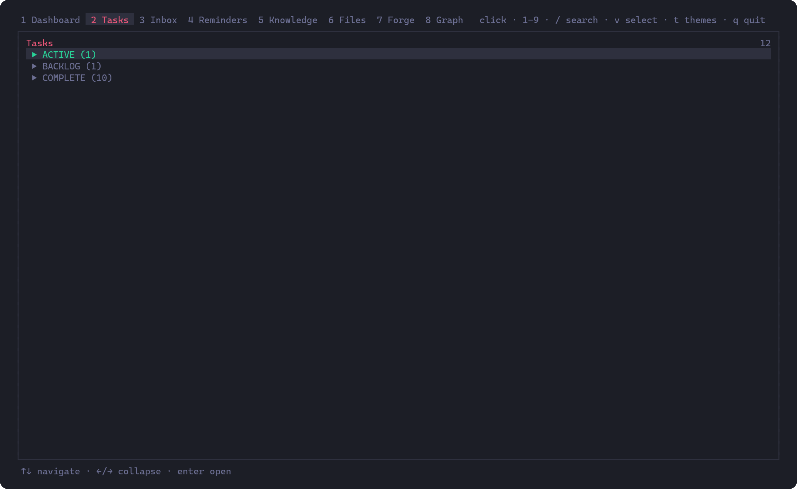
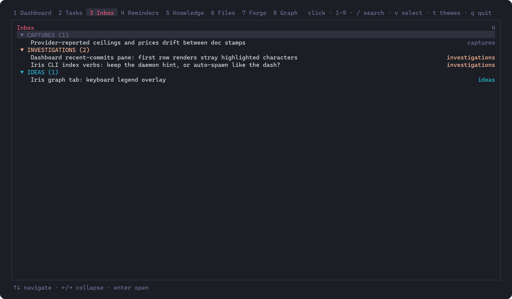
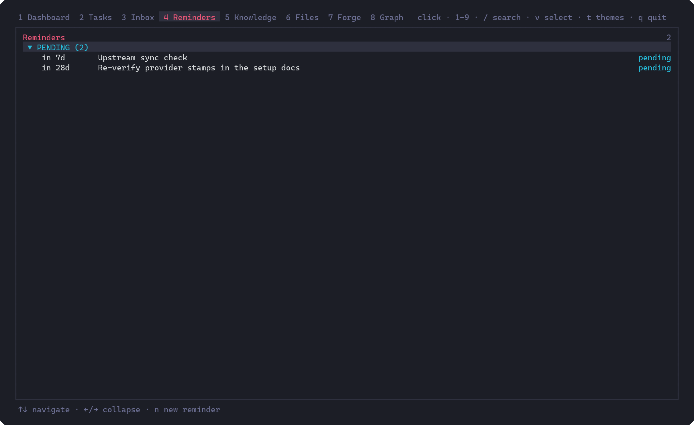
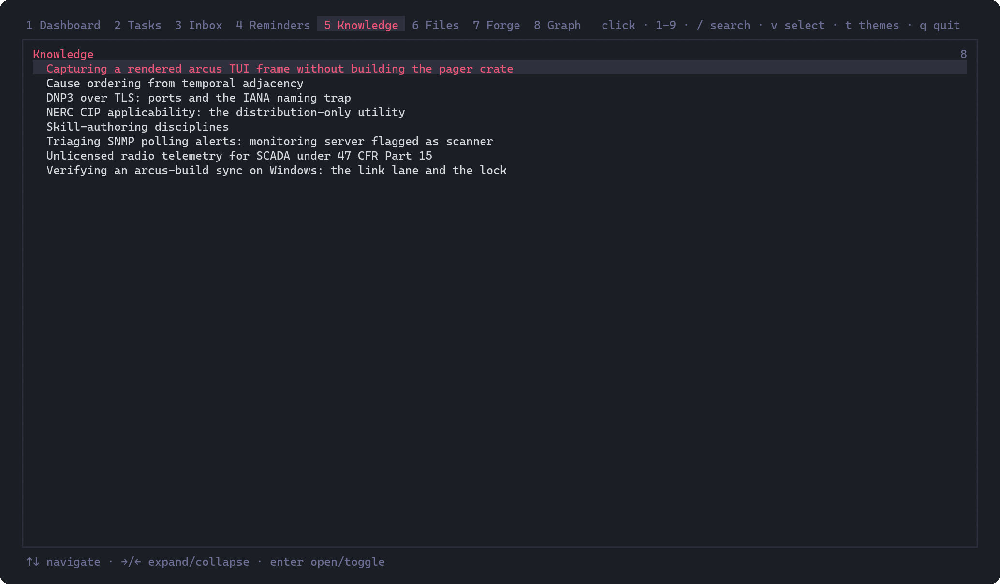
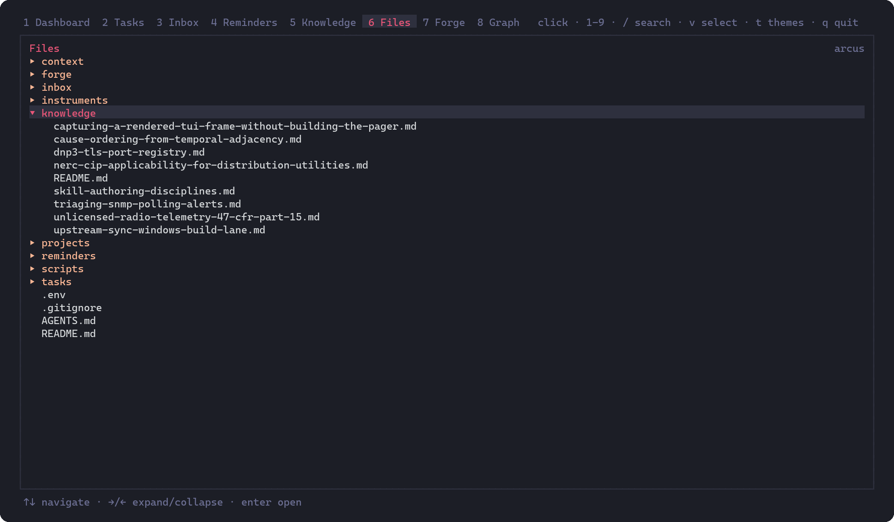
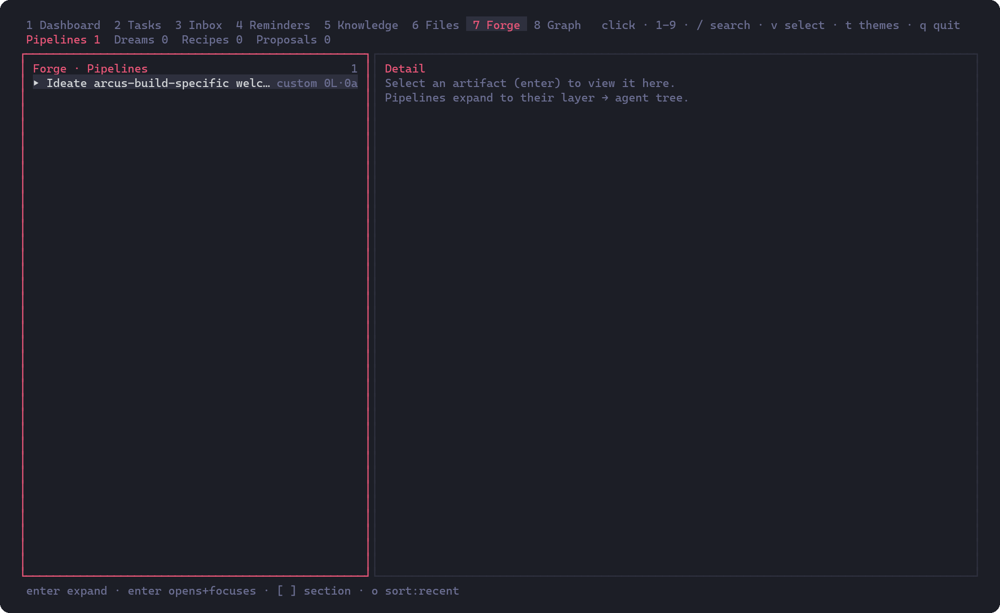
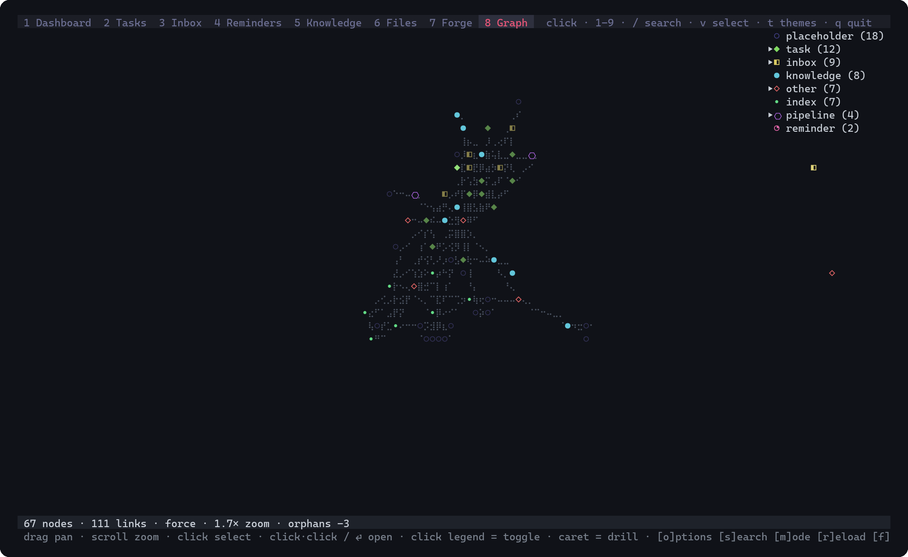

# Iris companion

**Iris** is a first-class companion of Amore Build: the knowledge and
organization instrument for a house tree. It is **never required** to run
Amore Build itself — sessions, models, and the agent loop work without it.
It is what gives a house a live file index, org CRUD verbs, and an
interactive dash over the same scaffold `amore init` plants.

Local-first: the daemon binds loopback only (`127.0.0.1`), and the daemon
and CLI operate on directories on your machine. There is no product
telemetry surface in iris.

In-tree sources live at [`instruments/iris/`](../instruments/iris/).
Package-level detail: [`instruments/iris/README.md`](../instruments/iris/README.md);
building from source: [`instruments/iris/BUILD.md`](../instruments/iris/BUILD.md).

---

## What it is

Three surfaces share one product name:

| Surface | Role |
|---------|------|
| **Daemon** | Live org index on `127.0.0.1:3853` — recursive file watch, wikilink/backlink graph, fuzzy search (`/api/search`, index mode) |
| **CLI** (`iris`) | Org verbs powered by `@amore/regula` (`task`, `inbox`, `reminder`, `knowledge`, plus `status`, `search`, `daemon`, …) and daemon-backed reads |
| **Dash** (TUI) | OpenTUI interactive dashboard — Dashboard / Tasks / Inbox / Reminders / Knowledge / Files / Forge / Graph (hotkeys `1`–`8` in that order) |

Iris ships the full regula org-CRUD surface — every task / inbox / reminder /
knowledge lifecycle verb, plus `lint`, `status`, `search`, `links`, and
`graph`. (`regula`'s forge-review verbs are not yet routed as CLI verbs; the
dash's Forge tab is the forge surface.) `iris commands` prints the
capability manifest for the org-verb surface; `daemon`, `dash`, and
`commands` itself are routed above it.

### The dash

Every frame below is a capture of the real dash over a real house tree
(`scripts/capture_frame.py` + `scripts/render_frame.py` in this repo — a
pty, a VT emulator, and a font-verified renderer; never a mockup).

**Dashboard** — orientation at a glance: status tiles, the agenda, recent
changes from the house's own state surface:


**Tasks / Inbox / Reminders** — the org tree grouped by lifecycle, the same
`1`–`8` hotkeys the tab bar shows:







**Knowledge / Files** — the distilled-notes index and the raw tree:





**Forge** — pipeline artifacts, expanded to their layer → agent tree:



**Graph** — the wikilink/backlink graph, force-laid, typed and legended:



### Common commands

```sh
iris                     # open the dash (when available)
iris dash                # same
iris daemon [--port N]   # start the index daemon (default 3853)
iris status              # orientation counts (daemon-independent)
iris task list --json
iris inbox list
iris reminder list
iris knowledge create --title "…"
iris search "query"      # fuzzy index search via the daemon
iris commands            # org-verb capability manifest
```

Org root resolution: `$IRIS_ORG_ROOT` if set, else walk up from the cwd for
an orientation file (`AGENTS.md` / `AGENT.md` / `CLAUDE.md`) beside a `tasks/`
directory (the daemon also accepts the root as a positional argument, which
wins). Callers refuse a silent cwd fallback when no root resolves.

### The regula core

Every write — CLI verb or dash action — goes through **`@amore/regula`**,
the org write authority. It owns the document schemas (frontmatter shapes
per type), the **legal lifecycle transitions** (a task moves
`active → review → complete`, not arbitrarily; terminal inbox items get a
`resolution` and move to `resolved/`), **folder placement** (status decides
the directory, and the verbs move files when status changes), and the
**lint** (`iris regula lint` — errors fail, warnings are the open
data-quality queue). The point of routing writes through one core: a verb
cannot produce a file the house schema would call malformed, and two
surfaces (CLI, dash) cannot drift apart on what "complete" means.

The house is wired to it natively: the `AGENTS.md` that `amore init` plants
teaches the resident agent to prefer the iris verbs for org CRUD and to run
`iris regula lint` before ending a session — so the agent, the CLI, and the
dash all write through the same authority. When iris is absent, direct file
edits against the schemas remain fully legitimate; the files are the source
of truth either way.

The **dash** auto-spawns the daemon when nothing answers on the port. Plain
CLI verbs that need the index do not auto-spawn — they fail with a one-line
hint to start it.

---

## Install

### A. With the house (default)

**`amore init` installs iris for you.** Creating a house downloads the
release archive for your platform, verifies its published checksum, and
unpacks both binaries into `instruments/iris/` inside the house. This is the
only part of `init` that touches the network — `--no-iris` skips it and
makes `init` fully offline.

A failed download never fails the house: the tree is already written, the
summary names what happened, and `amore init --refresh` finishes the job
later.

Init also puts iris **on your `PATH`** — by linking the binaries (multi-tool
and dash) into the directory the running `amore` executable lives in. If
`amore` resolves on `PATH`, `iris` now does too; no shell-config or registry
surgery, same behavior on every platform. The init summary names the
directory when the link lands; if that directory is unwritable the binaries
still work from `instruments/iris/`, and `amore setup` step 3 records
whether `iris` was found on `PATH`.

Published targets: `linux-x64`, `windows-x64`, `darwin-arm64`. Other hosts
are told plainly there is no published asset and pointed at the source build.

### B. Release asset (manual)

Each release publishes one archive per platform:

```
iris-{suffix}.tar.gz        # linux-x64, darwin-arm64
iris-{suffix}.exe.zip       # windows-x64
```

Every archive contains **both** binaries:

```
iris-{os}-{arch}          # multi-tool: CLI + regula verbs + Bun daemon (~99 MB)
iris-dash-{os}-{arch}     # the OpenTUI dash (TTY required)
```

Keep them side by side (`iris dash` re-execs the sibling dash binary, or
`$IRIS_DASH_BIN`), and put the multi-tool on `PATH` as `iris`.

### C. Source build

Requires **Bun 1.3.x**. From this repository:

```sh
cd instruments/iris
bun install
bun run scripts/build-compile.ts              # CLI + daemon → dist/iris-{os}-{arch}
bun run scripts/build-compile.ts --with-dash  # also dist/iris-dash-{os}-{arch}
```

Escape hatch without compile (always works after `bun install`):

```sh
bun packages/cli/src/iris.ts daemon --port 3853 <org_root>
bun packages/cli/src/iris.ts task list --json
bun packages/tui/src/index.tsx                 # dash
# or: bun packages/cli/src/iris.ts dash
```

More detail: [`instruments/iris/README.md`](../instruments/iris/README.md).

---

## The Amore Build seam

Iris is optional at every layer. Absence is quiet.

### `amore init`

Installs the companion into the house by default (`--no-iris` opts out) —
see Install §A above.

### `amore setup`

`amore setup` is a three-step guided flow: model provider → Grok rail →
**Iris companion (recommended, opt-out)**. Step 3 detects whether `iris` is
on `PATH` and can plant a pointer file under the amore home:

```
~/.amore/iris-companion.toml
```

That file is a **pointer, not an install**. It records whether `iris` was
found on `PATH` (and the expected asset name for this host when it was not) —
`amore init` does the installing. Headless `amore setup` prints the step
only and does not plant unless you re-run interactively (or write the file
yourself).

### Shortcuts bar (when the companion is present)

When iris is installed and detected, the Amore Build TUI surfaces a
shortcuts-bar hint that launches **`iris dash` in a new terminal**. The
action is **Ctrl+Shift+G** (label `dash`) — mnemonic for the "glass", and
deliberately not Ctrl+Shift+D, which Windows Terminal binds to `duplicatePane`
by default and swallows before the TUI sees it. The in-product shortcuts
cheatsheet is the source of truth if the binding ever moves.
When iris is **not** installed, that hint is **hidden**.

---

## Multi-tool behavior

The compiled multi-tool embeds CLI verbs and the daemon. It does **not** embed
OpenTUI.

| Invocation | Behavior |
|------------|----------|
| `iris` / `iris dash` | Re-execs a sibling dash binary when present (`iris-dash-*`, `IRIS_DASH_BIN`, or short `iris-dash` names next to the multi-tool). Sets `IRIS_DAEMON_BIN` to the multi-tool if unset so the dash can auto-spawn the daemon. |
| Same, no dash sibling | Prints the source-build / compile recipe to stderr and **exits 64**. |

Daemon defaults:

| Knob | Default |
|------|---------|
| Bind / port | `127.0.0.1:3853` (loopback-only by design; the bind is pinned, the port is `IRIS_PORT` / `--port`) |
| Env prefix | `IRIS_*` (e.g. `IRIS_PORT`, `IRIS_URL`, `IRIS_ORG_ROOT`, `IRIS_DAEMON_BIN`, `IRIS_ALLOW_FOREIGN_ROOT`, …) |
| Home / state | `~/.iris` (crash logs, `allowed-roots.json`, …) |

---

## Trust model (reads vs mutations)

Tiered foreign-root trust (current product model):

| Operation | Policy |
|-----------|--------|
| **Reads** (daemon index, search, graph, dash viewing) | Unguarded on any resolved org root — no house-marker requirement |
| **Mutations** (regula CRUD / lifecycle: create, complete, archive, …) | Require a **house root** (orientation doc + `tasks/`) **or** explicit opt-in |

House markers (same walk-up idea as org-root resolution): `AGENTS.md` or
`AGENT.md` or `CLAUDE.md` **and** a `tasks/` directory.

Mutation opt-in channels (any one suffices):

1. CLI flag `--allow-foreign-root`
2. Env `IRIS_ALLOW_FOREIGN_ROOT=1` (also accepts `true` / `yes`)
3. Path listed in `~/.iris/allowed-roots.json` (interactive TTY confirm can plant this; non-interactive must use flag or env)

Every refusal names a one-line remedy. Writes go through `@amore/regula`; the
CLI calls `ensureMutationTrust` on write verbs before mutating.

**Honest current state:** org-root resolution via `IRIS_ORG_ROOT` and the
CLI mutation trust seam are live today. Do not assume a richer dash-side trust
UX or automatic wiring beyond what the CLI/daemon already enforce — further
dash trust presentation is a follow-on, not a promised surface.

---

## Pointer file

Path: **`~/.amore/iris-companion.toml`** (under `$AMORE_HOME` / `$GROK_HOME`
when those override the default home).

| Fact | Detail |
|------|--------|
| Who writes it | `amore setup` interactive step 3 (opt-out with skip) |
| What it is | Companion **pointer** config — PATH detection / expected asset name |
| What it is not | An installer, a download cache, or a runtime dependency of Amore Build (`amore init` does the installing) |
| Without iris | Amore Build runs normally; optional UI hint stays hidden |

Example shape (fields depend on PATH detection):

```toml
# Iris companion pointer — written by `amore setup` / first-run wizard.
# Iris is optional; this file is not an install.

[iris]
detected = false
expected_asset = "iris-linux-x64"
```

---

## See also

- [onboarding.md](onboarding.md) — what `amore init` installs; `--no-iris`
- [setup-models.md](setup-models.md) — model recipes (setup wizard step 1)
- [authentication.md](authentication.md) — OAuth vs BYOK rails (setup wizard step 2)
- [`instruments/iris/README.md`](../instruments/iris/README.md) — layout, env list, run recipes
- [`UPSTREAM.md`](../UPSTREAM.md) — fork delta summary (iris called out as companion)
